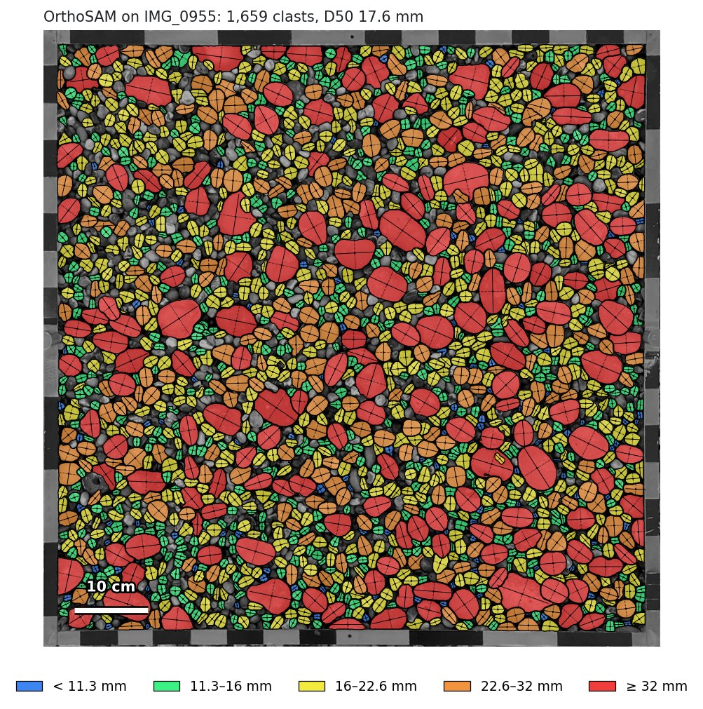
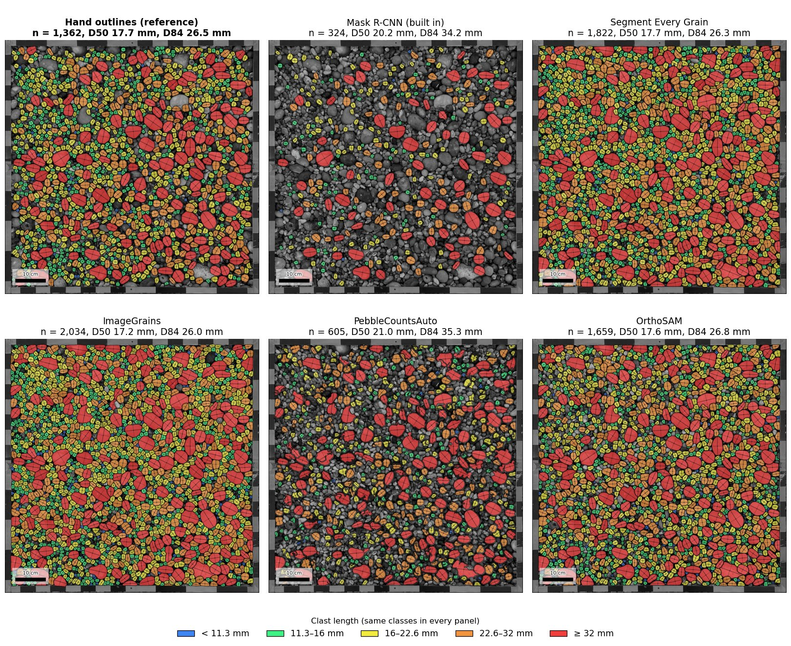
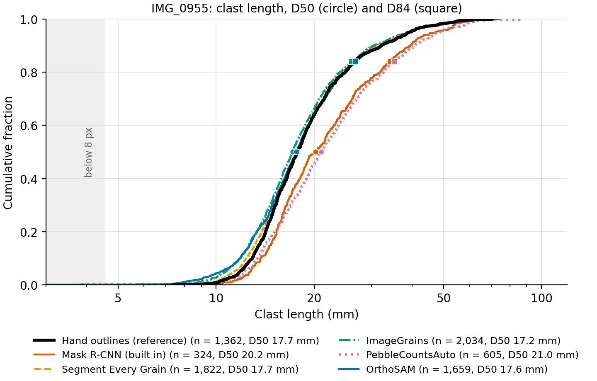

# OrthoSAM as a PebbleMapper detection model

This plug-in lets [PebbleMapper](https://github.com/soloyant/pebblemapper) detect clasts
with [OrthoSAM](https://github.com/UP-RS-ESP/OrthoSAM) (Chan, Rheinwalt & Bookhagen,
2026). OrthoSAM prompts Meta's Segment Anything (SAM v1) with a grid of points over
overlapping 1024-pixel tiles, keeps one mask per point, and adds coarser passes on a
downsampled image to catch grains larger than a tile. The adapter runs OrthoSAM in its
own conda environment (`pm-orthosam`), receives the outlines as a label image and hands
them to PebbleMapper, which measures every clast with its own measurement step. Sizes are
therefore defined exactly as for PebbleMapper's built-in Mask R-CNN model. Nothing in
PebbleMapper or in OrthoSAM is modified.

The repository holds the adapter (built on PebbleMapper's `InstanceSubprocessBackend`),
the script that runs inside the `pm-orthosam` environment and the environment file.
OrthoSAM's code and the SAM checkpoints are not included; scripts fetch them from their
authors.

## Requirements

- A working PebbleMapper installation.
- Conda (Miniconda or Anaconda) and Git.
- About 5 GB of disk space for the environment and 375 MB for the default SAM checkpoint
  (ViT-B); ViT-L is 1.2 GB and ViT-H 2.5 GB.
- An NVIDIA GPU is strongly recommended. With ViT-B and the default settings the model
  runs on a 4 GB card. On a machine without an NVIDIA GPU, install the CPU build of
  PyTorch instead; detection is then much slower.

## Installation

1. Clone OrthoSAM into `upstream/`, at the commit the adapter was tested with:

   ```bat
   python scripts\get_upstream.py
   ```

2. Create the environment and install the packages. From this folder:

   ```bat
   conda create -y -n pm-orthosam -c conda-forge python=3.12 pip
   conda activate pm-orthosam
   pip install torch==2.5.1+cu121 torchvision==0.20.1+cu121 --index-url https://download.pytorch.org/whl/cu121
   pip install segment-anything==1.0 "numpy<2.4" opencv-python-headless tifffile scikit-image scipy pandas psutil tqdm requests matplotlib pillow rasterio
   ```

   `environment.yml` lists the same versions for reference, and `scripts/create_env.sh`
   runs these steps in one go from Git Bash.

3. Download the SAM checkpoint into `weights/`:

   ```bat
   python scripts\download_weights.py
   ```

   This fetches ViT-B (`sam_vit_b_01ec64.pth`) from Meta. Add `vit_l` or `vit_h` to the
   command to fetch the larger ones. Set `PM_ORTHOSAM_WEIGHTS` to store them elsewhere.

4. Declare the backend in PebbleMapper's `user_detectors.json`. Copy
   `user_detectors.example.json` and set `path` to the folder of this repository:

   ```json
   [
    {"module": "pm_orthosam_backend.backend", "factory": "make_backend",
     "path": "C:/path/to/pebblemapper-backend-orthosam"}
   ]
   ```

5. Restart PebbleMapper.

## Usage in PebbleMapper

After the restart, **OrthoSAM (Chan, Rheinwalt & Bookhagen)** appears in the **Detection
model** selector in the left panel, next to Mask R-CNN. Select it and run detection as
usual. The result is the same per-clast table as with Mask R-CNN.

| | Mask R-CNN (built in) | OrthoSAM |
|---|---|---|
| Runs in | PebbleMapper's own environment | its own conda environment `pm-orthosam` |
| Trained for | clasts on the beach photographs of the PebbleMapper project | not trained for grains; SAM is a general-purpose segmenter |
| Confidence score | yes | none; every clast is scored 1.0 and *Filter by confidence* is not applied |
| Quadrat mode | yes | yes (whole photograph) |
| Ortho mode | tiles, resume, nodata and ROI filters, deduplication | each job is handed to OrthoSAM whole; it tiles and merges itself; no resume, no tile filters, no ROI |

Points to note:

- **Smallest grain.** The authors report reliable detection from about 30 pixels across.
  Finer grains are found only in part. The `upsample` option (below) enlarges the image
  before segmentation, at a cost that grows with its square.
- **Speed.** OrthoSAM is slow: every tile is prompted with 900 points and each prompt is
  refined. Expect minutes per quadrat photograph on a GPU, and hours for a large
  ortho-image.
- **Framed quadrat photographs.** SAM segments every object, including the bars of a
  quadrat frame. A photograph rectified by PebbleMapper's Orthorectify carries the
  frame's thickness in its sidecar, and the frame band is left out automatically. For any
  other framed photograph, draw an *ROI per image* (Detect tab).
- **Model options** are passed through the `PM_ORTHOSAM_OPTIONS` environment variable as
  JSON, for example `{"upsample": 2, "points_per_axis": 30}`:

  | Option | Default | Meaning |
  |---|---|---|
  | `upsample` | 1 | resample factor of the first pass |
  | `coarse_passes` | `[upsample / 2]` | resample factors of the later passes; `[]` for none |
  | `tile_size` | 1024 | SAM tile, in pixels |
  | `tile_overlap` | 200 | overlap between tiles, in pixels |
  | `points_per_axis` | 30 | prompt grid per tile; GPU memory grows with its square |
  | `stability_t` | 0.85 | SAM stability-score threshold |
  | `dilation_size` | 5 | OrthoSAM's mask dilation |
  | `min_area_px` | 30 | smallest grain kept, in pixels of the original image |

- **Larger checkpoints.** Set `PM_ORTHOSAM_MODEL` to `vit_l` or `vit_h` (after
  downloading them) before starting PebbleMapper. ViT-H is the authors' default and needs
  more GPU memory than a 4 GB card has.

PebbleMapper writes the model's name, version and licence into every run's
`.manifest.json`.

## Licences

This repository contains only the adapter. OrthoSAM is cloned from its repository by
`scripts/get_upstream.py`, Segment Anything is installed by pip, and the checkpoints are
downloaded by `scripts/download_weights.py`.

| Component | Copyright | Licence |
|---|---|---|
| This adapter | © 2026 Antoine Soloy | MIT (`LICENSE`) |
| OrthoSAM (code) | © the OrthoSAM authors | Apache-2.0 |
| Segment Anything (code, `segment-anything` 1.0) | © Meta Platforms, Inc. | Apache-2.0 |
| SAM checkpoints (`sam_vit_b_01ec64.pth` and others) | © Meta Platforms, Inc. | Apache-2.0 |

The adapter is an independent project and is not affiliated with or endorsed by the
authors of OrthoSAM or Segment Anything.

## Citation

If you use this model, cite the OrthoSAM paper:

Chan, V., Rheinwalt, A., & Bookhagen, B. (2026). OrthoSAM: multi-scale extension of the
Segment Anything Model for river pebble delineation from large orthophotos. *Earth
Surface Dynamics*, 14, 391–416. https://doi.org/10.5194/esurf-14-391-2026

Also cite Segment Anything (Kirillov et al., 2023).

## The example quadrat

The rectified quadrat photograph of PebbleMapper's `example_03_Etretat` (IMG_0955: 0.84 m
frame, 0.567 mm/px, a densely packed flint beach) was run through OrthoSAM with the ViT-B
checkpoint, the frame band left out and each clast measured by PebbleMapper's own step.
The same photograph was run through the other models PebbleMapper can use, for
comparison.

| Model | Detections | Hand-outlined clasts found | Detections that match one | Length RMSE | D50 | D84 | Time per photograph |
|---|---|---|---|---|---|---|---|
| Hand outlines | 1,362 | | | | 17.7 mm | 26.5 mm | |
| **OrthoSAM, native resolution (default)** | 1,659 | 1,079 (79 %) | 65 % | 1.4 mm | 17.6 mm | 26.8 mm | 430 s (GPU) |
| **OrthoSAM, `upsample` 2** | 2,742 | 1,344 (99 %) | 49 % | 1.3 mm | 14.7 mm | 22.2 mm | 2,000 s (GPU) |
| Mask R-CNN (PebbleMapper, built in) | 324 | 320 (23 %) | 99 % | 1.6 mm | 20.2 mm | 34.2 mm | 41 s (GPU) |
| Segment Every Grain | 1,822 | 1,350 (99 %) | 74 % | 1.0 mm | 17.7 mm | 26.3 mm | 259 s (GPU) |
| ImageGrains | 2,034 | 1,316 (97 %) | 65 % | 1.7 mm | 17.2 mm | 26.0 mm | 51 s (CPU) |
| PebbleCountsAuto | 605 | 491 (36 %) | 81 % | 4.1 mm | 21.0 mm | 35.3 mm | 17 s (CPU) |

Detections are paired with the 1,362 hand-outlined clasts by position and size, as
PebbleMapper's Validate tab does. The hand outlines leave out many of the smallest grains
between the larger clasts, so a detection with no hand-outlined partner is not
necessarily wrong: with `upsample` 2, half of OrthoSAM's unmatched detections are
shorter than 11.9 mm, the length 95 % of the hand-outlined clasts exceed, and these
small grains also lower its D50. The hand outlines started from Segment Every Grain's
detections, which favours that model here. Times are for one photograph on a 2018 laptop
(Intel Core i7-8850H, NVIDIA Quadro P600 with 4 GB).

<p align="center">
  
</p>
<p align="center"><em>OrthoSAM's detections on the example quadrat at native resolution: each clast filled by size class and outlined, its long and short axes drawn.</em></p>

<p align="center">
  
</p>
<p align="center"><em>The hand outlines and the five models side by side on the same photograph, coloured on the same size classes.</em></p>

<p align="center">
  
</p>
<p align="center"><em>Cumulative distributions of clast length, D50 (circle) and D84 (square) marked; the grey band is below 8 pixels.</em></p>
